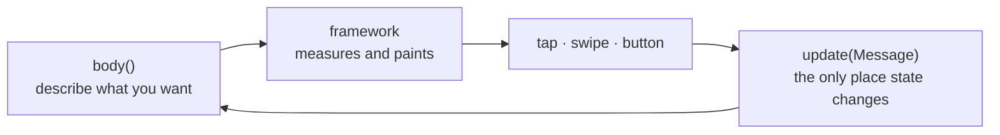

# `xpui`

> ⚠️ **Under heavy development.** Not production-ready. The API can break
> without notice. Use at your own risk.

A small declarative UI framework for e-ink firmware: you describe what the
screen should look like, and `xpui` works out the rest.

It was written for e-ink readers — 1-bit panels, a few hundred KB of RAM, no
GPU and no room for waste. Those constraints shaped every decision in here.

What it deliberately holds *no* trace of is any one product, or any one way of
drawing: no screen, no asset name, no setting, no string, and no dependency on
the thing that paints. It reaches whatever hosts it through a handful of traits
that a [backend](https://github.com/XPUI-Framework/xpui-backends) implements. That is what keeps product detail out
of layout code, what lets the same screen run on FreeInkUI and on
`embedded_graphics`, and what lets the whole test suite run on a laptop instead
of a device.

## At a glance

- **No dependencies.** Not one, and no build script. What is in `src/` is the
  whole of it.
- **`no_std`.** Runs on bare metal; runs on your laptop for tests.
- **Nothing to draw with.** `xpui` cannot paint a pixel by itself — a backend
  supplies that, through five small traits.
- **Every test runs on a laptop.** None of them needs hardware or a simulator.

## Getting started

A screen is a struct that says what it looks like and how it changes. That's it:

```rust
use xpui::{vstack, NavigationScreen, Screen, Stepper, Text, View};

struct Brightness {
    level: i32,
    /// Built when the value changes rather than when the screen is described.
    label: String,
}

/// Everything this screen can be told.
#[derive(Clone, Copy)]
enum Msg {
    Set(i32),   // an absolute value, from dragging the track
    Step(i32),  // a nudge of -1 or +1, from the end glyphs
}

impl Screen for Brightness {
    type Message = Msg;

    fn body(&self) -> impl View<Msg> {
        NavigationScreen::new(vstack![12;
            Text::new(&self.label),
            Stepper::new(self.level)
                .on_change(Msg::Set)
                .on_step(Msg::Step),
        ])
    }

    fn update(&mut self, message: Msg) {
        self.level = match message {
            Msg::Set(level) => level.clamp(0, 100),
            Msg::Step(delta) => (self.level + delta).clamp(0, 100),
        };
        // Formatted here, not in `body`. `body` runs on every paint and every
        // frame carrying input; `update` runs when the value actually changes.
        self.label = format!("Brightness  {}%", self.level);
    }
}
```

That is a working screen. It draws a header, a label and a stepper; it responds
to a finger on the track, to the `−` and `+` glyphs, and to the hardware buttons
— and you did not write a single coordinate, hit-test or redraw call.

The loop it sits in is the whole of the contract:



It cannot reach a screen yet, though: `xpui` has no idea one exists. A
[backend](https://github.com/XPUI-Framework/xpui-backends) is what connects it to something that can paint —
FreeInkUI, `embedded_graphics`, or a desktop window.

## How the pieces talk to each other

This is the part worth understanding, and it is simpler than it looks. There are
**three conversations**, and each one only goes one way.

```text
        your screen                xpui                    the firmware
   ┌───────────────────┐   ┌──────────────────┐   ┌──────────────────────┐
   │                   │   │                  │   │                      │
   │  body()   ────────┼──▶│   view tree      ├──▶│  Canvas       paint  │
   │                   │   │   measure        │   │  TextMetrics  sizes  │
   │                   │   │   render         │   │  Chrome       theme  │
   │  update(msg) ◀────┼───┤   routing        │◀──┤  InputSource  touch  │
   │                   │   │                  │   │  Clock        time   │
   └───────────────────┘   └──────────────────┘   └──────────────────────┘
          messages              the View trait          the Host traits
```

**1. Your screen and `xpui` talk in messages.** `body()` hands over a description
of the screen. When something happens, `xpui` hands back a message and calls
`update()`. Your screen never reads a touch, never asks where anything is on
screen, and never asks for a repaint — it only ever receives a message and
changes its own state.

**2. `xpui` and the view tree talk through the `View` trait.** Every widget
answers four questions: how big are you, where do you sit, what do you draw, and
what can be touched. Widgets *declare* their touchable regions; nothing polls
for input.

**3. `xpui` and the backend talk through the `Host` traits.** `xpui` cannot
draw, measure text or read a button. It says what it needs and a backend
provides it. This is why the crate has no dependencies, and why nothing inside
it names a product, a screen, an asset or a drawing library.

The whole frame is: build the tree, measure it, collect what is touchable, find
the message for whatever the user did, apply it, paint. If that leaves you
wanting the detail, it is in [docs/architecture.md](docs/architecture.md).

## How it reaches a screen

`xpui` needs somewhere to draw. A backend implements five traits — paint,
measure text, draw themed furniture, read input, tell the time — and installs
that implementation once:

```rust
# static MY_BACKEND: xpui::testing::TestHost = xpui::testing::TestHost;
// Once, before anything is measured or drawn.
unsafe { xpui::host::install(&MY_BACKEND) };
```

The traits live in [`src/host/`](src/host/) and are deliberately small. Nothing
else in `xpui` knows a backend exists, which is why a fake host makes the whole
framework testable. See [docs/host.md](docs/host.md) for what each trait must
do, and [`crates/backend/`](https://github.com/XPUI-Framework/xpui-backends) for the real ones.

## What you get

**Widgets** — [`src/widgets/`](src/widgets/)

| | |
|---|---|
| [`Text`](src/widgets/text.rs) | One line, measured with the backend's real font metrics |
| [`Icon`](src/widgets/image.rs) | A backend asset chosen by *role*, not filename |
| [`IconToggle`](src/widgets/icon_toggle.rs) | An icon that shows a boolean and flips it |
| [`Image`](src/widgets/image.rs) | A 1-bit bitmap you supply |
| [`List` / `ListRow`](src/widgets/list/) | Rows drawn by the backend's own theme |
| [`Section`](src/widgets/section.rs) | A titled group of anything |
| [`Toggle`](src/widgets/toggle.rs) | A boolean row reading On / Off |
| [`Slider`](src/widgets/slider.rs) | A track, moved by a drag, a tap or a key, over its own name and value |
| [`Stepper`](src/widgets/stepper.rs) | `−`, track and `+` as one control, over the same line |
| [`ProgressBar`](src/widgets/progress.rs) | Determinate progress |
| [`Divider`](src/widgets/divider.rs) | A one-pixel rule |
| [`Modal`](src/widgets/modal.rs) | A centred option dialog that captures input while open |

**Layout** — [`src/layout/`](src/layout/)

`vstack!` and `hstack!` stack things with a gap. `Spacer` eats whatever space is
left, so a footer sits at the bottom without arithmetic. `Padding`, `Frame`,
`Flexible` and `Tappable` are chainable modifiers: `Text::new("−").frame(44, 44)`.

`ScrollView` wraps content taller than the screen. It clips what overflows and
the runtime scrolls to keep the focused control visible — by swipe on a touch
panel, by Up/Down on a button one — so a screen never tracks a scroll position.

**Screen roots** — [`src/screen/`](src/screen/)

`NavigationScreen` is an ordinary page with a header and button hints, and takes
an `.overlay()` drawn above its content for dialogs. `OverlayPanel` is a
drop-down that leaves the screen beneath it intact, and can dim it with
`Scrim::Dim`.

## Worth knowing before you start

- **`body()` runs often** — on every repaint and while a finger is dragging. It
  allocates, so keep heavy work out of it. This is a real cost, not a hypothetical.
- **Text is a single line.** There is no wrapping widget yet, and list rows that
  carry a subtitle are single-line by the theme's own rule.
- **One `ScrollView` per screen.** The scroll offset lives in the runtime beside
  focus, so a second one would share the first one's position.
- **One thing is global**: the installed host. It is set once at startup and
  only read afterwards.

## Where next

- [docs/tutorial.md](docs/tutorial.md) — from an empty file to a screen
- [docs/a-second-screen.md](docs/a-second-screen.md) — lists, navigation,
  scrolling, and where to go for a widget of your own
- [docs/architecture.md](docs/architecture.md) — how a frame actually runs
- [docs/writing-a-widget.md](docs/writing-a-widget.md) — adding to the framework
- [docs/testing.md](docs/testing.md) — the four layers, and driving a screen the way a person does
- [docs/host.md](docs/host.md) — the contract a backend implements
- [`crates/backend/`](https://github.com/XPUI-Framework/xpui-backends) — how a backend fits, and which ones exist

## License

MIT — see [LICENSE](LICENSE). Copyright (c) 2026 Thiago Holanda.
