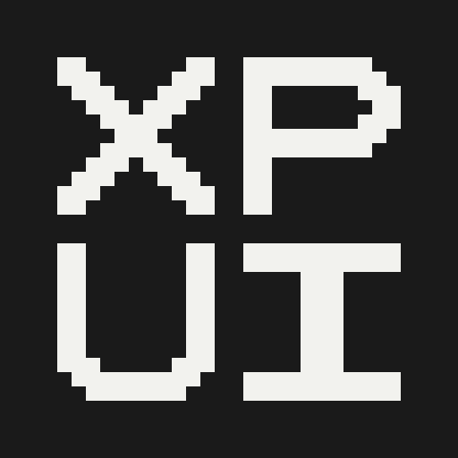
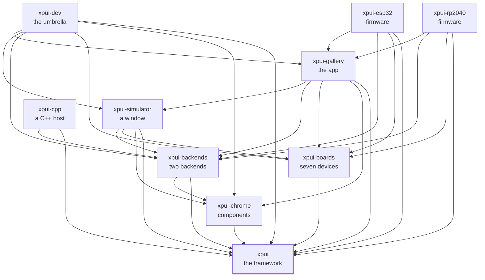

[](https://github.com/XPUI-Framework/xpui-framework/actions/workflows/ci.yml) [](LICENSE)

<picture>
  <source media="(prefers-color-scheme: dark)" srcset="assets/logo-black.png">
  
</picture>

# XPUI Framework

> [!WARNING]
> Under heavy development. Not production-ready. The API can break without
> notice. Use at your own risk.

A small declarative UI framework for e-ink firmware: you describe what a
screen looks like and how it changes, and `xpui` measures, routes input and
paints. It was written for e-ink readers — 1-bit panels, a few hundred KB of
RAM, no GPU and no room for waste — and those constraints shaped every
decision in it. It has no dependencies and no build script, runs `no_std` on
bare metal, and holds no trace of any product or drawing library: a
[backend](https://github.com/XPUI-Framework/xpui-backends) supplies the
painting through five small traits, which is what lets every test run on a
laptop.

Every document in this repository is listed in [docs/README.md](docs/README.md).

## Using it

```toml
[dependencies]
xpui = { git = "https://github.com/XPUI-Framework/xpui-framework", branch = "main" }

[dev-dependencies]
# The fake host: a backend that records every draw call instead of painting,
# so a screen can be tested with no window and no device.
xpui = { git = "https://github.com/XPUI-Framework/xpui-framework", branch = "main", features = ["testing"] }
```

Nothing is on crates.io yet, which is why the dependency above is a `git` URL. A
screen is a struct that says what it looks like and how it changes:

```rust
use xpui::{vstack, NavigationScreen, Screen, Stepper, Text, View};

struct Brightness {
    level: i32,
    /// Built when the value changes rather than when the screen is described.
    label: String,
}

/// Everything this screen can be told.
#[derive(Clone, Copy)]
enum Msg {
    Set(i32),   // an absolute value, from dragging the track
    Step(i32),  // a nudge of -1 or +1, from the end glyphs
}

impl Screen for Brightness {
    type Message = Msg;

    fn title(&self) -> Option<&'static str> {
        Some("Brightness")
    }

    fn body(&self) -> impl View<Msg> {
        NavigationScreen::new(vstack![12;
            Text::new(&self.label),
            Stepper::new(self.level)
                .on_change(Msg::Set)
                .on_step(Msg::Step),
        ])
    }

    fn update(&mut self, message: Msg) {
        self.level = match message {
            Msg::Set(level) => level.clamp(0, 100),
            Msg::Step(delta) => (self.level + delta).clamp(0, 100),
        };
        // Formatted here, not in `body`. `body` runs on every paint and every
        // frame carrying input; `update` runs when the value actually changes.
        self.label = format!("Brightness  {}%", self.level);
    }
}
```

That is a working screen: a header, a label and a stepper that answers a
finger on the track, the `−` and `+` glyphs, and the hardware buttons, with no
coordinate, hit-test or redraw call written. It cannot reach a panel yet —
`xpui` has no idea one exists — so a
[backend](https://github.com/XPUI-Framework/xpui-backends) connects it to
something that can paint. `alloc` is required; `std` is used only by the
`testing` module.

## Checking it

```bash
./build-and-test.sh
```

The checks themselves are in [`xtask/`](xtask/) — this repository's own list,
in Rust, holding nothing it does not run. `./build-and-test.sh fix` formats
in place first. Format, clippy on the host and two bare-metal architectures,
the tests, every documented snippet compiled, every public item documented,
and every link and command in the prose resolved. How a change is reviewed
is in [docs/contributing.md](docs/contributing.md).

## Where it sits

Every arrow is a dependency in a `Cargo.toml`, and they all point inward
toward `xpui`, which depends on nothing at all. That is the rule the
organisation is arranged around: a backend can be written without the framework
knowing it exists, and a firmware reaches whatever it needs directly rather
than through whoever happens to sit above it.



## License

MIT — see [LICENSE](LICENSE). Copyright (c) 2026 Thiago Holanda.
