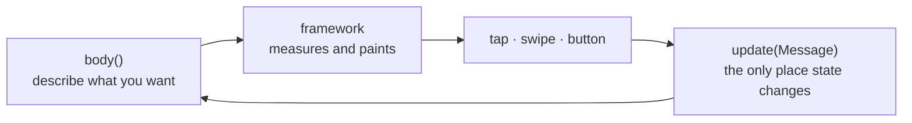

# How a frame runs

Three conversations, each one way; then what actually happens between them,
in order; then what the crate holds. It is short because the design is small.

## The three conversations

```text
        your screen                xpui                    the firmware
   ┌───────────────────┐   ┌──────────────────┐   ┌──────────────────────┐
   │                   │   │                  │   │                      │
   │  body()   ────────┼──▶│   view tree      ├──▶│  Canvas       paint  │
   │                   │   │   measure        │   │  TextMetrics  sizes  │
   │                   │   │   render         │   │  Chrome       theme  │
   │  update(msg) ◀────┼───┤   routing        │◀──┤  InputSource  touch  │
   │                   │   │                  │   │  Clock        time   │
   └───────────────────┘   └──────────────────┘   └──────────────────────┘
          messages              the View trait          the Host traits
```

**1. Your screen and `xpui` talk in messages.** `body()` hands over a description
of the screen. When something happens, `xpui` hands back a message and calls
`update()`. Your screen never reads a touch, never asks where anything is on
screen, and never asks for a repaint — it only ever receives a message and
changes its own state.

**2. `xpui` and the view tree talk through the `View` trait.** Every widget
answers four questions: how big are you, where do you sit, what do you draw, and
what can be touched. Widgets *declare* their touchable regions; nothing polls
for input.

**3. `xpui` and the backend talk through the `Host` traits.** `xpui` cannot
draw, measure text or read a button. It says what it needs and a backend
provides it. This is why the crate has no dependencies, and why nothing inside
it names a product, a screen, an asset or a drawing library.

The loop a screen sits in is the whole of the contract:



The whole frame is: build the tree, measure it, collect what is touchable, find
the message for whatever the user did, apply it, paint. The rest of this page
is that sentence, unfolded.


## The cast

| | |
|---|---|
| **Your screen** | A struct with `body()` and `update()`. Holds state; touches nothing else. |
| **The runtime** | [`src/screen/runtime/`](../src/screen/runtime/mod.rs). Drives one screen. |
| **The view tree** | Whatever `body()` returned. Thrown away after each use. |
| **The host** | A backend. Paints, measures, reads input. |

The runtime is the only part that talks to everyone. Your screen and the
backend never meet.

## A frame with a touch in it

The application calls into the runtime once per loop:

1. **Read input.** The runtime asks the host what happened — a tap, a drag, a
   button, nothing.
2. **Build the tree.** It calls your `body()`. You return a fresh description of
   the screen; nothing is kept between frames.
3. **Measure it.** Each view is offered a size and reports what it actually
   wants. Stacks divide space between children; a `Spacer` claims what is left.
4. **Collect what is touchable.** Each view *declares* rectangles it responds to,
   along with the message to send. A slider declares its track, a row declares
   itself, a label declares nothing.
5. **Resolve.** [`src/screen/routing.rs`](../src/screen/routing.rs) finds which
   declaration the touch landed in, scanning backwards so the innermost control
   wins.
6. **Deliver.** The runtime calls `update()` with that message. You change your
   state. The runtime asks for a repaint.

Painting is the same steps 2–4 followed by a `render` pass, because the tree no
longer exists — it was dropped at the end of the last frame.

## Why rebuild the tree every time

Because it removes a whole category of bug. There is no stored tree that can
disagree with your state, no "I changed the value but the screen still shows the
old one", no invalidation to get wrong. `body()` is a pure function of your
struct, so what you see is always what you hold.

The cost is real: `body()` runs on every repaint and on every frame of a drag,
and it allocates. That is the trade, made deliberately. Keep expensive work in
`update()`, where it happens once per event, rather than in `body()`.

## Messages, not callbacks

A widget does not run your code. It carries a value you gave it, and hands that
value back:

```rust
# use xpui::{Screen, Stepper, View};
# #[derive(Clone, Copy)]
# enum Msg { Set(i32) }
# struct Brightness { level: i32 }
# impl Screen for Brightness {
#     type Message = Msg;
#     fn body(&self) -> impl View<Msg> {
Stepper::new(self.level).on_change(Msg::Set)
#     }
#     fn update(&mut self, _message: Msg) {}
# }
```

`Msg::Set` here is not a call — it is the constructor of an enum variant, used
as a function. When the track is dragged, the runtime builds `Msg::Set(72)` and
passes it to `update()`.

This is why `update()` is the only place your state changes, and why you can
test a screen by calling `update()` directly with no UI at all.

## Declaring instead of hit-testing

A view says *what* it responds to, never *whether it was hit*:

```rust
# use xpui::{InputMask, Interactions, Point, Rect, Size, Trigger};
# #[derive(Clone, Copy)]
# enum Msg { Tapped }
# let mut out: Interactions<Msg> = Interactions::new(0);
# let rect = Rect { origin: Point::ORIGIN, size: Size::new(200, 40) };
# let msg = Msg::Tapped;
out.declare(rect, InputMask::TAP, Trigger::Message(msg));
```

The mask matters. A control that only accepts `TAP` never sees the frames while
a finger is held down, so it cannot be dragged by accident; a slider asks for
`DRAG` and does. The runtime handles focus, auto-repeat on a held button and the
minimum touch target, because every control declares the same way.

## Where the backend fits

The runtime never calls the backend directly. It goes through the five traits in
[`src/host/`](../src/host/) — `Canvas`, `TextMetrics`, `Chrome`, `InputSource`,
`Clock` — reached through small façades like `Renderer::fill_rect(..)`.

A backend implements those five and installs the implementation once:

```rust
# static MY_BACKEND: xpui::testing::TestHost = xpui::testing::TestHost;
// Once, before anything is measured or drawn.
unsafe { xpui::host::install(&MY_BACKEND) };
```

Two consequences worth stating:

- `xpui` compiles with **no dependencies** and cannot name a backend symbol.
- Tests install a fake host, so layout, input routing and widget behaviour are
  all testable on a laptop. That is how the suite runs with no simulator at all.

See [host.md](host.md) to implement one, and
[`xpui-backends`](https://github.com/XPUI-Framework/xpui-backends) for the
real ones.

## The one piece of global state

The installed host. `install()` is called once at startup and only read
afterwards. It exists so a widget can write `Renderer::fill_rect(..)` instead of
threading a context parameter through every `measure`, `render` and
`interactions` call in the tree.

On the device the two callers run on different tasks, so the runtime installs it
from both entry points rather than assuming which arrives first.

## What the crate holds

[reference.md](reference.md) is every public item the crate holds, by area,
each with its declaration, examples and a picture of what it draws.
[writing-a-widget.md](writing-a-widget.md) carries what a widget author adds
to it, `Trigger` and `Interactions` among them.
